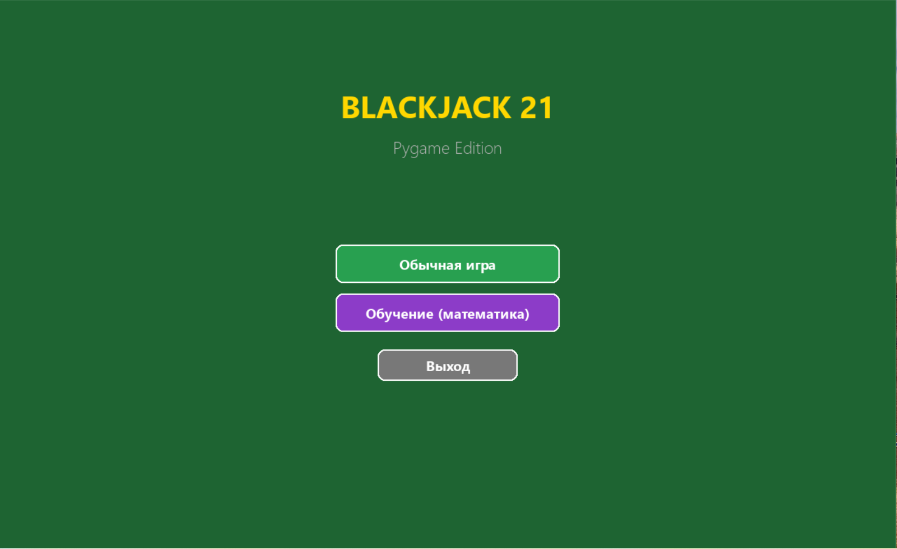
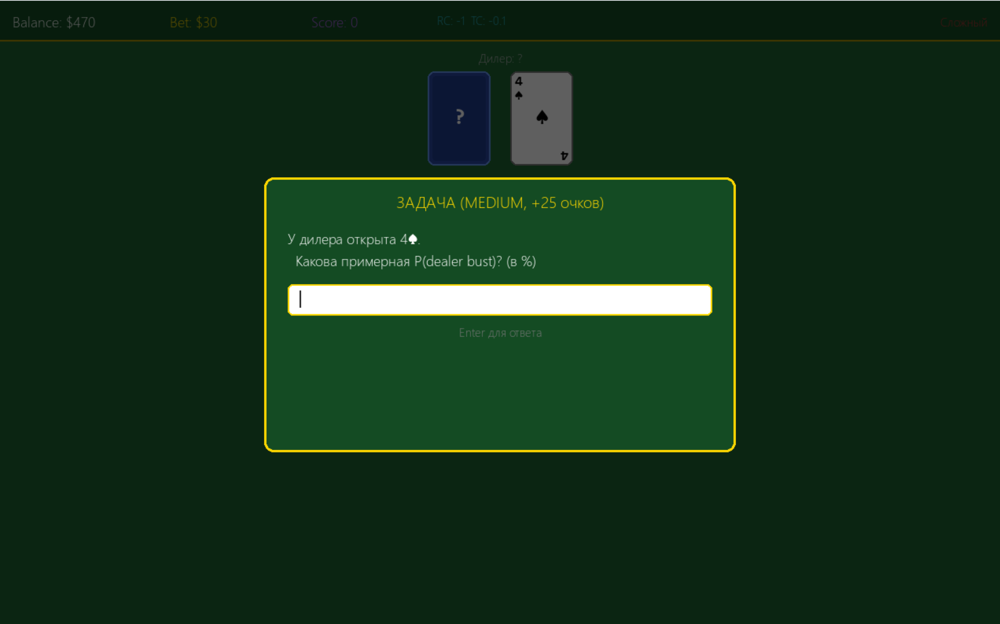
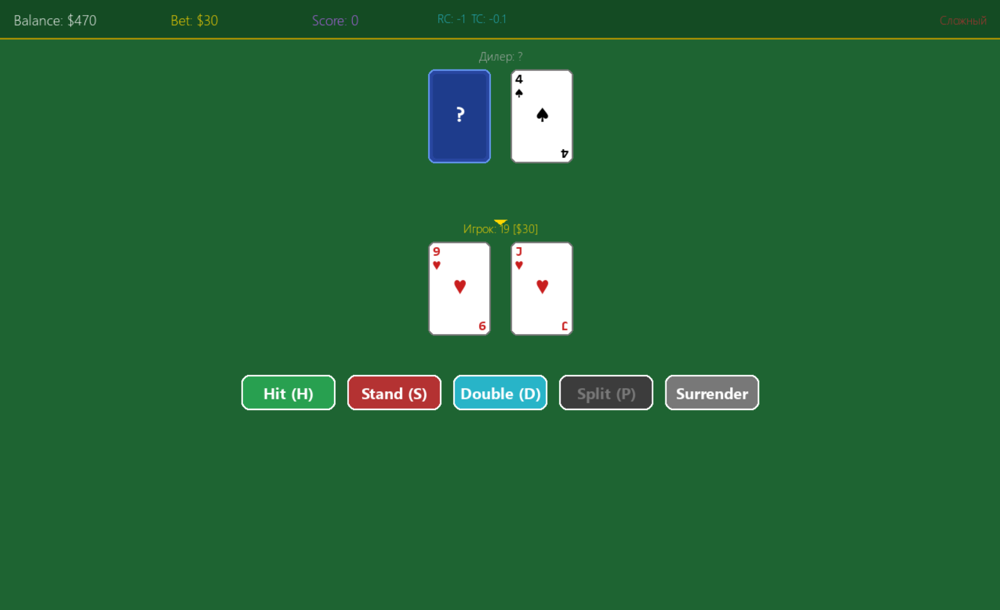

# BLACKJACK 21

Образовательная игра в блэкджек с режимом обучения теории вероятностей.

## Скриншоты

| Главное меню | Задача (обучение) | Игровой процесс |
|:---:|:---:|:---:|
|  |  |  |

## Возможности

- **Обычная игра** — классический блэкджек с полным набором действий (Hit, Stand, Double, Split, Surrender)
- **Режим обучения** — 24 типа задач по теории вероятностей прямо во время игры:
  - Формула Лапласа, правило дополнения, комбинаторика
  - Правило сложения P(A∪B) и умножения P(A∩B)
  - Hi-Lo Card Counting (Running Count, True Count)
  - Условная вероятность, формула Байеса
  - Математическое ожидание E(X), дисперсия, σ
  - Критерий Келли (оптимальная ставка)
  - Формула Бернулли (биномиальное распределение)
  - Распределение Пуассона (редкие события)
- **HUD вероятностей** — панель с P(bust), EV(Hit), EV(Stand) и рекомендацией
- **Справочник** — 16 разделов теории (формулы, концепции, таблицы)
- **3 уровня сложности** — разные правила, баланс, и параметры обучения
- **Два интерфейса** — Terminal (консоль с ANSI-цветами) и GUI (Pygame)

## Уровни сложности

| Параметр | Легкий | Средний | Сложный |
|---|---|---|---|
| Баланс | $2000 | $1000 | $500 |
| Колоды | 4 | 6 | 8 |
| Blackjack | 3:2 | 3:2 | 6:5 |
| Dealer soft 17 | Stand | Stand | Hit |
| Мин. ставка | $10 | $15 | $25 |
| HUD | Да + подсказки | Да | Нет |
| Задачи | Easy/Medium | Все | Medium/Hard |

## Требования

- Python 3.11+
- Pygame (для GUI режима)

## Установка

```bash
pip install -r requirements.txt
```

## Запуск

### Через bat-файл (Windows)

```
blackjack.bat
```

### Напрямую

```bash
# Консольный режим
python main.py terminal

# GUI режим
python main.py gui

# Интерактивный выбор
python main.py
```

## Управление

### Terminal

- Ставка: ввести число, `q` — выход
- Действия: `H` Hit, `S` Stand, `D` Double, `P` Split, `R` Surrender

### GUI (Pygame)

- Клик по фишкам для ставки, кнопки действий или горячие клавиши
- `H` Hit, `S` Stand, `D` Double, `P` Split, `R` Surrender
- `ESC` — выход в меню
- `Enter` / `Space` — продолжить

## Структура проекта

```
BlackJack/
├── main.py                 # Точка входа
├── blackjack.bat           # Windows-лаунчер
├── blackjack/
│   ├── models.py           # Card, Suit, Rank, Shoe, Hand
│   ├── actions.py          # Action, RoundOutcome (enum)
│   ├── difficulty.py       # DifficultyLevel, DifficultyConfig
│   ├── game.py             # BlackjackGame (оркестратор)
│   ├── dealer.py           # StandardDealer (стратегия дилера)
│   ├── counter.py          # CardCounter (Hi-Lo)
│   ├── probability.py      # ProbabilityEngine (Monte Carlo, EV)
│   ├── trainer.py          # MathTrainer (генератор задач, валидация ввода)
│   ├── renderer.py         # TerminalRenderer (ANSI)
│   ├── input_handler.py    # TerminalInput
│   ├── stats.py            # Stats (статистика)
│   ├── menu.py             # Меню, выбор сложности, справочник
│   └── gui/
│       ├── config.py       # Цвета, размеры, константы
│       ├── sprites.py      # Отрисовка карт, кнопок, HUD (кроссплатформенные шрифты)
│       └── app.py          # Pygame-приложение (state machine)
└── tests/
    ├── test_models.py      # 29 тестов: Card, Rank, Suit, Hand, Shoe
    ├── test_probability.py # 16 тестов: bust, EV, dealer bust, Monte Carlo
    ├── test_trainer.py     # 22 теста: парсинг ввода, скоринг, генерация задач
    ├── test_counter.py     # 8 тестов: Hi-Lo counting, true count
    └── test_difficulty.py  # 5 тестов: пресеты сложности
```
