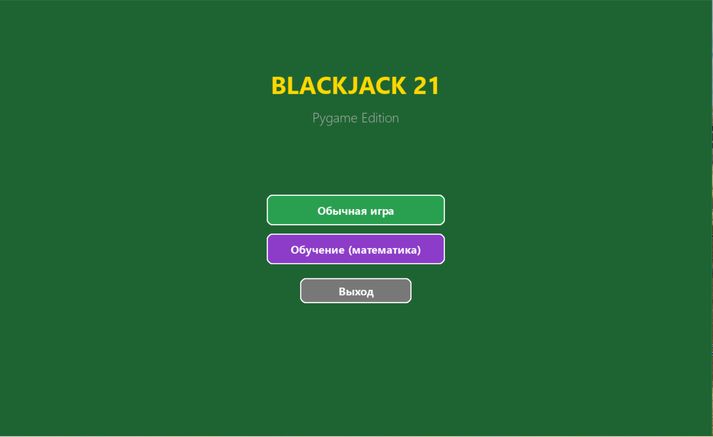
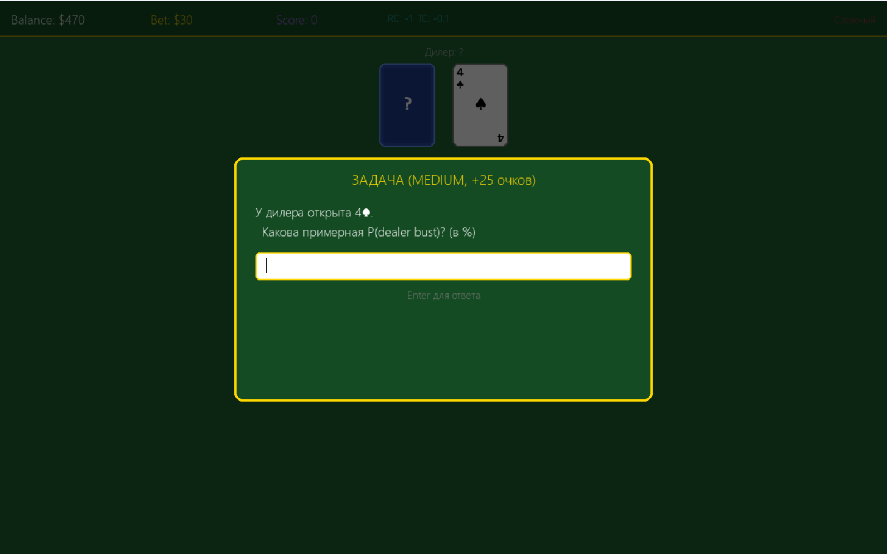
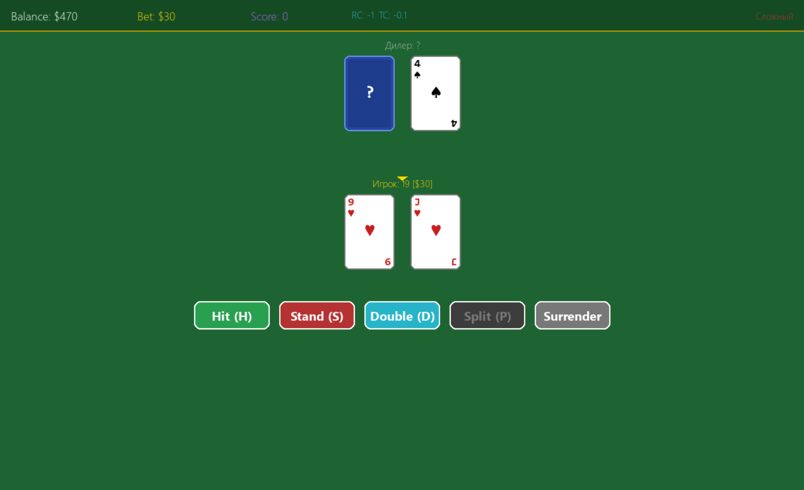

# BLACKJACK 21

Образовательная игра в блэкджек с режимом обучения теории вероятностей,
встроенной таблицей базовой стратегии, Hi-Lo Index Plays и headless-
бэктестером.

## Скриншоты

| Главное меню | Задача (обучение) | Игровой процесс |
|:---:|:---:|:---:|
|  |  |  |

## Возможности

- **Обычная игра**: Hit, Stand, Double, Split (до 4 рук), Surrender, Insurance.
- **Режим обучения**: 24 типа задач по теории вероятностей с динамическим
  выбором по слабым темам (weak-topic adaptive). Формула Лапласа,
  правило дополнения/сложения/умножения, Hi-Lo, Байес, Бернулли,
  Пуассон, E(X), D(X), критерий Келли.
- **Probability HUD**: P(bust), P(dealer bust) аналитически по точному
  составу shoe, EV(Hit) (рекурсивный оптимум, не one-card lookahead),
  EV(Stand).
- **Basic Strategy**: точная таблица для 6-deck S17 DAS (Hit/Stand/Double/
  Split/Surrender). Используется HUD-подсказкой и бэктестером.
- **Hi-Lo Index Plays**: Illustrious 18 + Fab 4 surrenders, плюс
  insurance-trigger по True Count.
- **Bet sizing**: TC-ramp 1-12 units для счётчика.
- **Persistent profile**: lifetime stats и weak-topic accuracy лежат
  в `~/.blackjack_edu/profile.json`.
- **Headless backtester**: симулирует 10k-100k+ рук, отчёт по PnL,
  win rate, sigma, ROI, P(bankruptcy).
- **Два интерфейса**: Terminal (ANSI) и GUI (Pygame).
- 146 unit-тестов, CI на GitHub Actions.

## Уровни сложности

| Параметр | Лёгкий | Средний | Сложный |
|---|---|---|---|
| Баланс | $2000 | $1000 | $500 |
| Колоды | 4 | 6 | 8 |
| Blackjack | 3:2 | 3:2 | 6:5 |
| Dealer soft 17 | Stand | Stand | Hit |
| Мин. ставка | $10 | $15 | $25 |
| HUD | Да + подсказки | Да | Нет |
| Задачи | Easy/Medium | Все | Medium/Hard |

## Установка

```bash
pip install -e .
# или с dev-зависимостями (pytest, ruff):
pip install -e ".[dev]"
```

Требуется Python 3.11+. Pygame ставится автоматически.

## Запуск

```bash
blackjack.bat          # Windows-меню
python main.py         # интерактивный выбор Terminal/GUI
python main.py terminal
python main.py gui
```

## Headless backtester

Запуск симуляции базовой стратегии (или Hi-Lo + Index Plays) для оценки
edge, дисперсии и риска банкротства:

```bash
python -m blackjack.backtest --hands 10000 --seed 42
python -m blackjack.backtest --hands 50000 --counting hi-lo --bankroll 10000
blackjack-backtest --help
```

Пример отчёта: PnL, ROI per unit, win rate, sigma per hand,
Sharpe-аналог, hand at which player went bankrupt (если случилось).

## Profile / persistence

После каждой завершённой сессии в `~/.blackjack_edu/profile.json`
сохраняются lifetime-статы (rounds, wins, profit), per-topic точность
тренера и log последних 30 сессий. На основе per-topic точности
weak-topic adaptive перевешивает выбор следующего вопроса так, чтобы
чаще предлагать тему с худшей accuracy.

## Управление

**Terminal**: ставка цифрой, `q` выход. Действия: `H` Hit, `S` Stand,
`D` Double, `P` Split, `R` Surrender.

**GUI (Pygame)**: клик по фишкам или те же горячие клавиши.
`ESC` выход в меню, `Enter`/`Space` продолжить.

## Структура проекта

```
BlackJack/
|-- main.py                       # точка входа
|-- pyproject.toml                # пакет, CLI-скрипты, ruff/pytest конфиг
|-- LICENSE                       # MIT
|-- blackjack.bat                 # Windows-лаунчер
|-- blackjack/
|   |-- models.py                 # Card, Rank, Suit, Hand, Shoe (seeded RNG)
|   |-- actions.py                # Action, RoundOutcome
|   |-- difficulty.py             # DifficultyLevel, DifficultyConfig
|   |-- game.py                   # BlackjackGame (оркестратор раундов)
|   |-- dealer.py                 # StandardDealer (soft-17 toggle)
|   |-- counter.py                # CardCounter (Hi-Lo RC, TC)
|   |-- probability.py            # ProbabilityEngine: аналитический P(bust),
|   |                             #   рекурсивный EV(Hit), кэш по shoe-сигнатуре
|   |-- basic_strategy.py         # таблица 6-deck S17 DAS
|   |-- strategy_deviations.py    # Illustrious 18 + Fab 4, bet-ramp
|   |-- trainer.py                # MathTrainer: 24 задачи, weak-topic adaptive
|   |-- persistence.py            # Profile + JSON store
|   |-- backtest.py               # headless CLI-симулятор
|   |-- renderer.py               # TerminalRenderer (ANSI, animation_delay)
|   |-- input_handler.py          # TerminalInput
|   |-- stats.py                  # Stats
|   |-- menu.py                   # меню, выбор сложности, справочник
|   +-- gui/                      # Pygame-интерфейс
+-- tests/                        # 146 тестов
    |-- test_models.py
    |-- test_probability.py
    |-- test_probability_cache.py
    |-- test_basic_strategy.py
    |-- test_strategy_deviations.py
    |-- test_persistence.py
    |-- test_backtest.py
    |-- test_game.py
    |-- test_trainer.py
    |-- test_counter.py
    +-- test_difficulty.py
```

## Запуск тестов

```bash
pytest                            # все 146 тестов
pytest tests/test_basic_strategy.py -v
ruff check blackjack tests        # lint
```

CI прогоняется на Python 3.11 и 3.12 (см. `.github/workflows/test.yml`).
